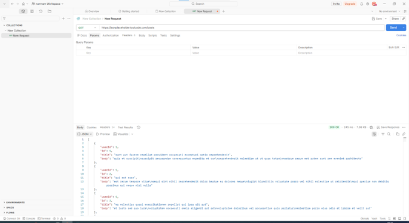
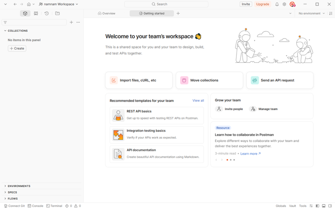
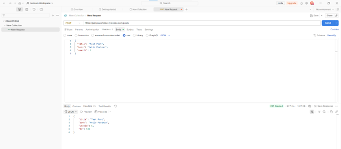
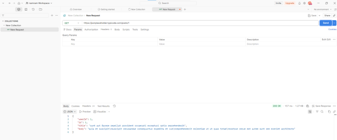
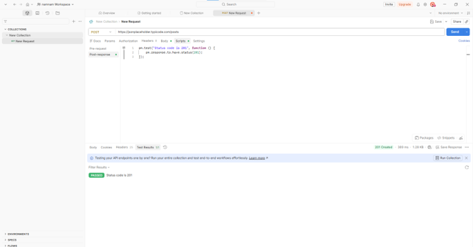

# BÁO CÁO THỰC HÀNH POSTMAN

## Thông tin sinh viên

* Họ và tên: [Điền họ tên]
* MSSV: [Điền MSSV]
* Lớp: [Điền lớp]

---

## Mục tiêu

* Tìm hiểu công cụ Postman.
* Thực hiện các API Request cơ bản.
* Kiểm thử API bằng Test Script.
* Quản lý Request bằng Collection.

---

## Công cụ sử dụng

* Postman
* GitHub

---

## Nội dung thực hiện

### 1. Cài đặt Postman

Đã cài đặt thành công Postman và khởi động ứng dụng.



---

### 2. Thực hiện GET Request lấy danh sách bài viết

URL:

https://jsonplaceholder.typicode.com/posts

Kết quả nhận được là danh sách các bài viết ở định dạng JSON.



---

### 3. Thực hiện GET Request lấy bài viết theo ID

URL:

https://jsonplaceholder.typicode.com/posts/1

Kết quả nhận được thông tin của bài viết có ID = 1.



---

### 4. Thực hiện POST Request

URL:

https://jsonplaceholder.typicode.com/posts

Body:

```json
{
  "title": "Test Post",
  "body": "Hello Postman",
  "userId": 1
}
```

Kết quả trả về thành công với dữ liệu vừa tạo.



---

### 5. Kiểm thử bằng Test Script

Script sử dụng:

```javascript
pm.test("Status code is 201", function () {
    pm.response.to.have.status(201);
});
```

Kết quả kiểm thử:



---

### 6. Tạo Collection

Đã tạo Collection để lưu và quản lý các Request.


---

## Kết luận

Sau khi thực hiện bài thực hành, em đã:

* Cài đặt và sử dụng được Postman.
* Thực hiện thành công GET Request và POST Request.
* Viết được Test Script cơ bản để kiểm tra phản hồi API.
* Biết cách sử dụng Collection để quản lý các Request.
* Hiểu quy trình kiểm thử API bằng Postman.
